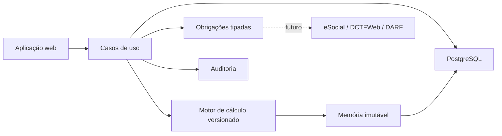

# Arquitetura

## Objetivo do primeiro recorte

Entregar folha de prestadores e apuração previdenciária com cálculo determinístico, memória reproduzível, segregação por organização e trilha de auditoria.



## Limites de domínio

### Identidade e organizações

Usuários, perfis, vínculo com organizações e segregação de acesso. Autenticação real será implementada no próximo incremento; autorização permanece obrigatoriamente no servidor.

### Pessoas e vínculos

Pessoa física/jurídica, prestador, termo, meta e vínculo. Dados contratuais usados na folha são congelados em snapshots no fechamento.

### Motor de folha

Regras por vigência, eventos, consolidação mensal por pessoa, folha, item, memória e histórico de estados. Uma folha fechada não deve ser editada silenciosamente.

### Obrigações

Débitos discriminados por tipo e origem. O domínio usa “obrigação fiscal”, permitindo DCTFWeb/DARF e GPS apenas quando juridicamente aplicável.

### Auditoria e documentos

Toda ação financeira relevante registra usuário, instante, estado anterior, estado novo e motivo. Documentos futuros terão metadados, hash e armazenamento protegido.

## Decisões importantes

- PostgreSQL é a fonte de verdade; navegador não guarda registros oficiais.
- Regras e tabelas fiscais são versionadas, nunca constantes sem vigência.
- Cálculo deve ser idempotente: repetir uma requisição não duplica folha ou obrigação.
- Integrações externas usarão outbox/fila, recibo e chave de idempotência.
- Dados reais não entram em testes; use fixtures anonimizadas ou sintéticas.
- Multi-organização será aplicada em todas as consultas e validada em testes.

## Estrutura do repositório

```text
app/                 rotas e páginas Next.js
components/          componentes de interface
db/                  schema relacional e acesso ao PostgreSQL
drizzle/             migrações versionadas
lib/                 regras de cálculo e dados demonstrativos
tests/               testes automatizados
docs/                arquitetura, domínio, deploy e referências
.github/workflows/   integração contínua
```

## Estado da persistência

Pessoas, Atividades e Lotações já usam consultas e ações de servidor conectadas ao
PostgreSQL. Todas as operações são filtradas pela empresa ativa, alterações são
validadas no servidor e a exclusão física foi substituída por inativação. As páginas de
folha, prestadores, parâmetros e obrigações ainda usam dados demonstrativos.

Na substituição progressiva dessas páginas por repositórios PostgreSQL, os contratos de
cálculo em `lib/calculos.ts` devem ser preservados, separando:

- entrada validada;
- regra/versionamento;
- resultado;
- memória detalhada;
- persistência transacional.
