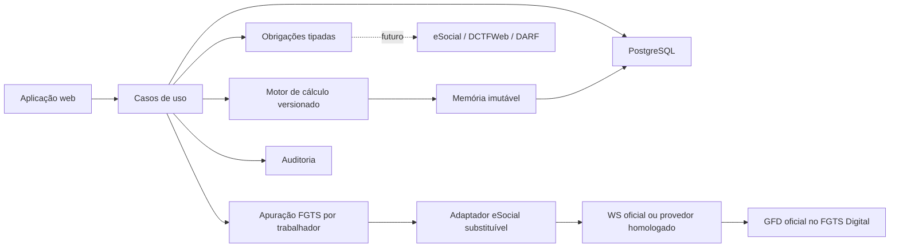

# Arquitetura

## Objetivo do primeiro recorte

Entregar folha de prestadores e apuração previdenciária com cálculo determinístico,
memória reproduzível, segregação por organização e trilha de auditoria. O alvo
revisado acrescenta folha trabalhista e FGTS Digital sem confundir os dois tipos de
relação.


```mermaid
flowchart LR
  UI["Aplicação web"] --> APP["Casos de uso"]
  APP --> CALC["Motor de cálculo versionado"]
  APP --> DB["PostgreSQL"]
  CALC --> MEM["Memória imutável"]
  MEM --> DB
  APP --> OBR["Obrigações tipadas"]
  OBR -. futuro .-> EXT["eSocial / DCTFWeb / DARF"]
  APP --> FGT["Apuração FGTS por trabalhador"]
  FGT --> ESO["Adaptador eSocial substituível"]
  ESO --> GOV["WS oficial ou provedor homologado"]
  GOV --> GFD["GFD oficial no FGTS Digital"]
  APP --> AUD["Auditoria"]
```

## Limites de domínio

### Identidade e organizações

Usuários, perfis, vínculo com organizações e segregação de acesso. Autenticação real será implementada no próximo incremento; autorização permanece obrigatoriamente no servidor.

### Pessoas e vínculos

Pessoa física/jurídica, prestador, termo, meta e vínculo. Dados contratuais usados na folha são congelados em snapshots no fechamento.

### Motor de folha

Regras por vigência, eventos, consolidação mensal por pessoa, folha, item, memória e histórico de estados. Uma folha fechada não deve ser editada silenciosamente.

O agregado multi-lote por pessoa possui simulação controlada e caminho produtivo
delimitado. Por padrão, a Folha continua bloqueando a mesma pessoa em mais de um lote
da competência. A organização só pode remover essa trava com ativação explícita por
empresa e competência inicial, e apenas uma simulação `HOMOLOGADA` ainda atual pode
alimentar cada item. A verificação ocorre na criação, no worker e no fechamento, sob
trava transacional por organização e mês.
O modelo-alvo está em [Consolidação mensal por pessoa](CONSOLIDACAO_MENSAL.md).
A aplicação consulta Vínculos, Termos, Metas, medições, Folhas e outras fontes sem
executar rateio fiscal. O diagnóstico pode ser materializado em
`consolidacao_mensal_caso`; cada versão guarda o SHA-256 canônico das entradas e possui
fontes imutáveis em `consolidacao_mensal_fonte`. O RH classifica o caso com responsável
e justificativa. Nova entrada invalida a decisão anterior sem apagá-la. Assim,
homologação operacional e cálculo fiscal permanecem responsabilidades separadas.
Casos resolvidos alimentam `consolidacao_fiscal_simulacao`; o motor agrega INSS/IRRF
por Pessoa, rateia por maior resto e congela cada entrada em
`consolidacao_fiscal_simulacao_fonte`. Quatro hashes protegem fontes, regra,
enquadramento e resultado. No modo produtivo habilitado, somente as linhas sistêmicas
de INSS e IRRF são substituídas pelo rateio homologado; proventos e descontos
contratuais precisam continuar idênticos. A memória da Folha registra a simulação e
seu hash, e o fechamento recusa cobertura incompleta, versão obsoleta ou item sem a
mesma evidência.

### Demonstrativo mensal

O demonstrativo financeiro é posterior à Folha. Ele reúne pagamentos PF originados
de Folhas fechadas, pagamentos PJ sustentados por documento, retenções vinculadas e
obrigações/guias. A Folha não é ampliada para representar PJ e a guia não é modelada
como beneficiário. Totais são conferidos por restrições diferidas no banco e o
conteúdo torna-se imutável no fechamento. Consulte
[Demonstrativo mensal de Camamu](DEMONSTRATIVO_MENSAL_CAMAMU.md).
Cada retificação congela a composição anterior, a aprovação e o fechamento em
snapshot imutável. O dossiê imprimível recalcula o hash tanto da revisão atual quanto
das versões históricas.

### Medições mensais

O Vínculo define se a medição é obrigatória. Cada competência pode registrar percentual,
quantidade × valor unitário ou valor apurado, sempre com responsável e evidência. A
Folha referencia a medição e congela seus parâmetros no snapshot. Alteração posterior
invalida o fechamento até novo processamento; Folha fechada protege a medição utilizada.

### Homologação paralela

Uma referência CSV do GIW ou do RH é comparada com os itens congelados da Folha pela
matrícula. O comparador converte valores em centavos, classifica diferenças e ausências
e não possui caminho para alterar o cálculo. O lote guarda SHA-256 do arquivo e da
revisão da Folha; lote e itens são imutáveis e auditados. Uma nova revisão exige nova
comparação, preservando a evidência anterior.

### Homologação da competência

O fechamento mensal é um agregado de evidências, não um segundo motor de cálculo. Ele
consulta oito controles operacionais, calcula hashes por item e um hash global, e
materializa uma versão imutável. A aprovação reexecuta o diagnóstico dentro da
transação e somente aceita o mesmo hash sem bloqueios. Fontes alteradas invalidam a
versão, preservando a decisão anterior. A campanha apresenta três competências
consecutivas para orientar a execução paralela e o corte.

### Apuração previdenciária

A obrigação consome exclusivamente Folhas fechadas. Cada item identifica natureza,
origem, base, alíquota, valor, item de Folha e snapshot. A primeira etapa materializa
`SEGURADO` e `PATRONAL` conforme o enquadramento previdenciário congelado na Folha.
A obrigação nasce bloqueada. Um totalizador DCTFWeb verificado e idêntico muda o
estado para apurada; somente recibo verificado e DARF do mesmo valor permitem o estado
emitida. Repetir a apuração recompõe a mesma chave empresa–competência–tipo sem
duplicação e invalida a conciliação anterior. A apuração exige todas as Folhas
fechadas e congela revisão e hash de cada origem. Antes de aceitar um documento
verificado, o servidor recusa Folha nova, pendente, reaberta ou com hash diferente.

### Folha trabalhista e FGTS

Prestador `701` continua no domínio previdenciário e não pode ser promovido
silenciosamente a empregado. O novo domínio aceita inicialmente as categorias `101`,
`103` e `721`, calcula e trunca o valor por trabalhador e tipo de valor, soma os itens
individualizados e preserva a fonte por hash.

`fgts_apuracao` versiona a competência; `fgts_apuracao_item` reconcilia a memória
interna com S-5003; `integracao_esocial_evento` mantém payload, protocolo, recibo e
retorno; `fgts_guia` referencia somente a GFD oficial. A comunicação usa a interface
`ProvedorEsocial`, permitindo Web Service direto ou serviço contratado sem alterar o
domínio. Consulte [FGTS Digital](FGTS_DIGITAL.md).

### Obrigações

Débitos discriminados por tipo e origem. O domínio usa “obrigação fiscal”, permitindo DCTFWeb/DARF e GPS apenas quando juridicamente aplicável.

### Auditoria e documentos

Toda ação financeira relevante registra usuário, instante, estado anterior, estado novo e motivo. Documentos futuros terão metadados, hash e armazenamento protegido.

## Decisões importantes

- PostgreSQL é a fonte de verdade; navegador não guarda registros oficiais.
- Regras e tabelas fiscais são versionadas, nunca constantes sem vigência.
- Cálculo deve ser idempotente: repetir uma requisição não duplica folha ou obrigação.
- Integrações externas usarão outbox/fila, recibo e chave de idempotência.
- Dados reais não entram em testes; use fixtures anonimizadas ou sintéticas.
- Multi-organização será aplicada em todas as consultas e validada em testes.

## Base operacional implementada

- um único pool PostgreSQL é reutilizado pelo processo Node, inclusive em produção;
- tamanho do pool, conexão, consulta, comando e transação ociosa têm limites configuráveis;
- Vínculos e Eventos recorrentes possuem restrições de exclusão no PostgreSQL, evitando
  sobreposição mesmo sob requisições concorrentes;
- relações cadastrais críticas usam chaves estrangeiras compostas com a organização;
  o banco rejeita referências acidentais entre empresas;
- alterações em Vínculos, Eventos, Folhas e Obrigações geram auditoria automática com
  estado anterior e posterior;
- Folhas fechadas são imutáveis no banco; a reabertura exige transação autorizada e motivo;
- tarefas persistentes possuem idempotência, prioridade, reserva com `SKIP LOCKED`,
  retentativas e recuperação de reservas expiradas;
- operações monetárias do motor usam centavos e proporções inteiras, evitando que o
  ponto flutuante binário decida arredondamentos fiscais;
- regras fiscais completas são persistidas por versão e vigência, rejeitam sobreposição,
  possuem hash canônico conferido na leitura e podem ser específicas da organização;
- o Compose não aceita segredos padrão, limita a exposição ao host local e controla logs;
- scripts de backup, checksum e restauração de teste estão versionados.
- lotes de homologação e suas diferenças são idempotentes por arquivo e hash da Folha,
  imutáveis no banco e vinculados à organização por chaves compostas.
- criação e processamento de Folhas da mesma competência são serializados por
  organização; conflitos da mesma pessoa entre lotes são recusados até existir
  consolidação fiscal determinística e homologada. A ativação produtiva é limitada por
  empresa e competência e não aceita uma composição de Vínculos diferente da simulação.
- casos de consolidação são serializados por organização e competência, materializados
  de forma idempotente, versionados pelo conteúdo e auditados no PostgreSQL; fontes
  congeladas não aceitam edição ou exclusão.
- simulações fiscais são serializadas por caso, idempotentes pelo conteúdo completo,
  versionadas, auditadas e protegidas por transições de estado; conteúdo calculado e
  decisões terminais são imutáveis.
- homologações mensais usam `REPEATABLE READ`, trava por organização/competência,
  versões idempotentes e itens imutáveis; o CSV do dossiê identifica os hashes global
  e individuais.
- cancelamentos preservam dados e usam transições de estado. Reabrir uma fonte
  bloqueia obrigações e invalida documentos; obrigação emitida impede alteração
  silenciosa da Folha.

O serviço worker já reserva tarefas com exclusão concorrente e possui um handler
operacional de validação da regra fiscal por competência e o handler `PROCESSAR_FOLHA`.
Esse handler bloqueia a Folha, valida empresa e revisão da tarefa, carrega a regra
congelada, calcula em centavos e substitui os itens dentro de uma única transação.

## Estrutura do repositório

```text
app/                 rotas e páginas Next.js
components/          componentes de interface
db/                  schema relacional e acesso ao PostgreSQL
drizzle/             migrações versionadas
lib/                 regras de cálculo e dados demonstrativos
tests/               testes automatizados
docs/                arquitetura, domínio, deploy e referências
.github/workflows/   integração contínua
```

## Estado da persistência

Pessoas, seus endereços, contas bancárias e dependentes, além de Atividades, Lotações,
Prestadores, Termos, Metas, Vínculos, Eventos e lançamentos recorrentes já usam consultas
e ações de servidor conectadas ao PostgreSQL. Prestador depende
de uma Pessoa da mesma empresa e não pode
duplicá-la dentro da organização. Meta depende de um Termo da mesma empresa, e cadastros
com dependências ativas não podem ser inativados. Vínculos exigem toda a cadeia da mesma
empresa, guardam a referência e a descrição contratada e bloqueiam sobreposição ativa
para o mesmo prestador, termo e meta. Todas as operações são filtradas pela
empresa ativa, alterações são validadas no servidor e a exclusão física foi substituída
por inativação. Eventos controlam natureza, modo de cálculo e incidências; lançamentos
recorrentes os ligam ao Vínculo por intervalo de competências e não podem se sobrepor.
As páginas de Folhas já usam dados persistentes: criam o lote, acompanham o worker,
exibem itens e linhas, solicitam revisão, fecham, reabrem com justificativa e exportam a
memória. Também importam a referência de homologação e apresentam diferenças por
matrícula. A página de Obrigações usa a apuração previdenciária e a conciliação
documental persistentes. A página de Parâmetros
consulta e valida as regras fiscais publicadas no PostgreSQL.

O processamento usa a medição conferida da competência quando existente; sem medição,
considera a retribuição contratual integral. Vínculos marcados como dependentes de
medição bloqueiam a Folha quando ela estiver ausente. Contribuições de outras fontes são registradas por
Prestador e competência, exigem comprovante marcado como verificado e ficam congeladas
na memória da revisão. A pré-validação impede enfileirar Folha com categoria fiscal,
NIT, comprovante ou medição obrigatória pendente. As fórmulas disponíveis permanecem
explícitas e precisam ser homologadas contra os contratos e relatórios reais.

Na substituição progressiva dessas páginas por repositórios PostgreSQL, os contratos de
cálculo em `lib/calculos.ts` devem ser preservados, separando:

- entrada validada;
- regra/versionamento;
- resultado;
- memória detalhada;
- persistência transacional.
