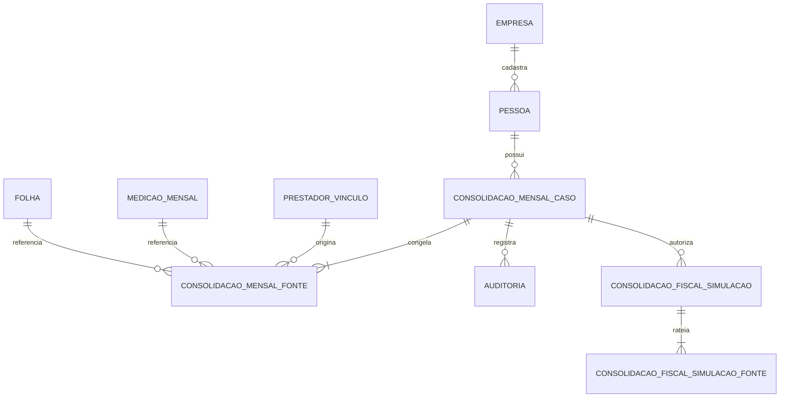
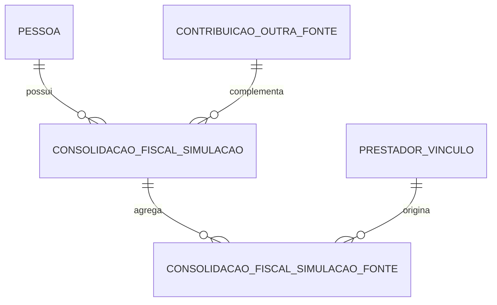

# Consolidação mensal por pessoa

## Por que este controle existe

INSS, teto previdenciário, deduções e IRRF não podem ser tratados como se cada Vínculo
de uma mesma pessoa fosse sempre independente. Uma pessoa pode prestar serviços em
mais de um Termo, Meta ou fonte pagadora durante a mesma competência. Somar resultados
calculados isoladamente pode duplicar deduções, ultrapassar limites ou produzir
retenções diferentes do total mensal correto.

O rateio multi-lote existe em simulação versionada e em um caminho produtivo
deliberadamente desativado por padrão. Sem ativação explícita, a criação e o
processamento da Folha seguem bloqueando a mesma Pessoa em lotes separados. Quando
ativado para uma empresa e a partir de uma competência, o caminho produtivo exige uma
simulação homologada ainda atual e usa o rateio exato nela congelado. A trava
transacional continua sendo aplicada por organização e competência.

Esse controle não substitui a conferência contábil. Ele cria uma fila auditável de
casos reais para que RH e contabilidade classifiquem e homologuem o motor controlado
antes de sua futura ativação produtiva.

## Fluxo operacional implementado

As rotas `/consolidacoes` e `/consolidacoes/simulacoes` executam três camadas:

1. **Diagnóstico vivo:** consulta os cadastros e movimentos atuais, sem gravar nem
   calcular tributos.
2. **Caso congelado:** persiste exatamente as fontes vistas, calcula um SHA-256
   canônico e abre uma decisão de RH para aquela versão.
3. **Simulação fiscal:** para casos resolvidos, recarrega todas as entradas fiscais,
   calcula INSS/IRRF por Pessoa, rateia por Vínculo e congela memória e hashes.

O operador deve:

1. selecionar a competência;
2. conferir pessoas, Vínculos, Termos, Metas, medições, Folhas e outras fontes;
3. informar o responsável e usar **Congelar diagnóstico atual**;
4. registrar cada caso como **Em análise** ou **Resolvido**;
5. selecionar a decisão final e descrever a evidência;
6. exportar o CSV para conferência e assinatura fora do sistema, se necessário;
7. abrir as simulações, gerar a versão e encaminhá-la à homologação;
8. conferir o espelho de cálculo com o GIW/RH e registrar a decisão;
9. congelar novamente após qualquer mudança relevante.

Repetir o congelamento sem mudar as fontes é idempotente: não duplica o caso. Se uma
entrada mudar, a versão anterior passa a `INVALIDADO`, deixa de contar para a prontidão
e continua visível na trilha.

## Estados e decisões

Estados:

- `PENDENTE`: caso recém-materializado, sem tratamento;
- `EM_ANALISE`: o RH registrou responsável e justificativa provisória;
- `RESOLVIDO`: decisão, justificativa e instante de resolução foram registrados;
- `INVALIDADO`: as fontes atuais não correspondem mais ao hash decidido.

Decisões:

- `UNIFICAR_VINCULOS`: o caso deve participar de um agregado único por pessoa;
- `RATEIO_NECESSARIO`: haverá distribuição entre fontes, ainda dependente da regra
  fiscal homologada;
- `NAO_APLICAVEL`: a ocorrência foi analisada e não representa consolidação fiscal;
  a justificativa deve explicar objetivamente a exceção.

Uma decisão de caso, isoladamente, **não** altera a Folha nem remove o bloqueio
multi-lote. Para `RATEIO_NECESSARIO` e `UNIFICAR_VINCULOS`, é indispensável uma
simulação `HOMOLOGADA`, revalidada contra fontes, regra, enquadramento e composição de
Vínculos atuais. O consumo pela Folha depende ainda da ativação operacional descrita
abaixo.

## Conteúdo do hash

O hash é determinístico e não depende da ordem retornada pelo banco. Ele inclui:

- competência e Pessoa;
- base comprovada em outras fontes;
- Vínculo, Termo, Meta e atividade;
- valor contratual e valor previsto;
- exigência, identificação e tipo de medição;
- identificação, número e estado da Folha.

Alterações nesses campos mudam o hash. A materialização invalida também casos de pessoas
que deixaram de ser multi-lote. Se um conjunto histórico idêntico voltar a ocorrer, o
caso é reativado como `PENDENTE`, com a decisão anterior limpa; a auditoria conserva a
sequência completa.

## Persistência e integridade

`consolidacao_mensal_caso` possui chave única por organização, competência, Pessoa e
hash. `consolidacao_mensal_fonte` possui uma linha por Vínculo do caso e um snapshot
JSON da origem. As relações usam chaves estrangeiras compostas com `empresa_id`, o que
impede referências entre organizações.

O banco aplica, independentemente da interface:

- competência no primeiro dia do mês;
- hash hexadecimal com 64 caracteres;
- estados e decisões enumerados;
- resolução somente com decisão, justificativa de 10 a 2.000 caracteres, responsável
  e instante;
- valores não negativos;
- fontes congeladas sem `UPDATE` ou `DELETE`;
- casos sem exclusão física;
- auditoria automática de inserções e mudanças.

A materialização usa `pg_advisory_xact_lock` por organização e competência. Assim, duas
requisições concorrentes não criam versões conflitantes.

## Exportação

O CSV contém uma linha por fonte e inclui:

- competência e hash;
- estado, decisão, responsável, instante e justificativa do caso atual;
- Pessoa, documento e matrícula;
- valores totais e base de outras fontes;
- Vínculo, Termo, Meta, atividade, medição e Folha.

O arquivo usa separador compatível com Excel em pt-BR, preserva identificadores como
texto, neutraliza fórmulas de planilha e informa o SHA-256 no cabeçalho HTTP. O valor
previsto é projeção contratual ou da medição, não uma base fiscal calculada.

## Invariantes de segurança contábil

- nenhuma ordem arbitrária de processamento decide o imposto;
- caso resolvido vale somente para o hash analisado;
- histórico invalidado nunca conta como prontidão atual;
- fonte congelada não pode ser corrigida no lugar;
- ausência de caso não é aprovação;
- classificação do RH não substitui memória de cálculo;
- o bloqueio multi-lote só sai após homologação do agregado, do rateio e ativação
  explícita para a organização e a competência.

## Agregado e rateio implementados em modo controlado

O imposto é calculado uma vez sobre o agregado mensal. A fonte da simulação explica a
distribuição por maior resto e congela regra, enquadramento, bases, dependentes, outras
fontes, medição, Eventos, resultados e hashes. Consulte
[Simulação fiscal consolidada](SIMULACAO_FISCAL_CONSOLIDADA.md).

## Ativação produtiva controlada

O caminho produtivo exige simultaneamente:

- `FOLHA_CONSOLIDADA_PRODUTIVA=true`;
- `FOLHA_CONSOLIDADA_EMPRESA_ID` igual ao UUID da única organização autorizada;
- `FOLHA_CONSOLIDADA_INICIO` no formato `AAAA-MM`.

Antes da competência inicial ou para outra organização, o bloqueio anterior permanece.
Web e worker devem receber exatamente os mesmos valores. A ativação não dispensa o
fluxo: caso resolvido, simulação homologada, fontes e parâmetros ainda atuais e mesma
composição de Vínculos.

Durante o processamento, a Folha recalcula cada Vínculo individualmente e confirma que
proventos e descontos de Eventos não mudaram. Somente então substitui INSS, IRRF, bases
e totais pelas parcelas homologadas, registrando `simulacaoId` e `hashResultado` na
memória e no snapshot. O fechamento exige que:

- todos os Vínculos ativos da Pessoa tenham uma Folha não cancelada;
- todos os itens tenham sido processados com a simulação homologada atual;
- revisão, memória e hash canônico da Folha permaneçam íntegros.

Desativar a variável volta a bloquear novas operações multi-lote; não reescreve Folhas
já fechadas nem apaga evidências.

## Decisões que ainda exigem homologação

RH e contabilidade precisam fornecer casos reais e confirmar:

1. se pagamentos de Termos distintos ocorrem na mesma data ou em datas diferentes;
2. como o legado acumula bases e retenções anteriores dentro do mês;
3. em qual item o saldo do teto previdenciário é consumido;
4. como dependentes e demais deduções são aplicados em vários pagamentos;
5. como ajustes e estornos alteram uma consolidação já fechada;
6. quais eventos entram nas bases previdenciária e de IRRF em cada cenário;
7. qual regra distribui resíduos de centavo sem depender da ordem dos workers.

## Critério para remover o bloqueio

- casos abaixo, no limite e acima do teto;
- um, dois e vários Vínculos;
- IRRF com dedução legal e simplificada;
- contribuições em outras fontes;
- reprocessamento em ordem diferente com o mesmo hash;
- estorno e retificação;
- comparação centavo a centavo com três competências reais do GIW;
- aprovação documentada do RH e da contabilidade.
