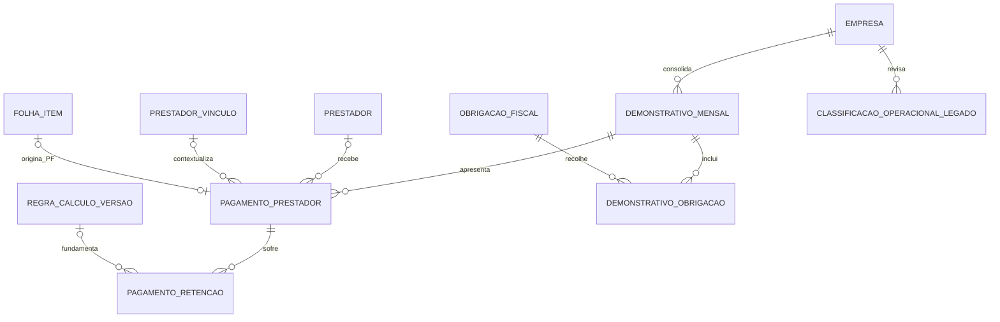
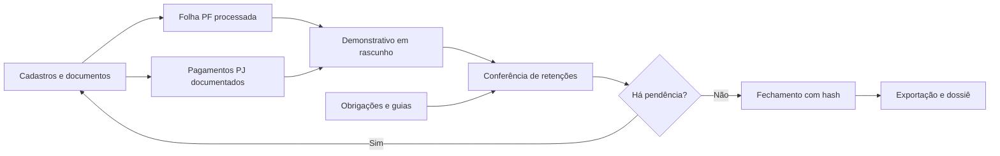

# Demonstrativo mensal de Camamu

## Decisão de produto

O demonstrativo mensal é a visão financeira consolidada da competência. Ele não é
sinônimo da Folha previdenciária de contribuinte individual.

Cada linha deve possuir exatamente uma das três naturezas operacionais:

1. `PAGAMENTO_PRESTADOR`: valor devido a uma pessoa física ou jurídica;
2. `RETENCAO_TRIBUTARIA`: parcela vinculada a um pagamento e sustentada por cálculo
   de Folha, documento fiscal, importação ou matriz fiscal homologada;
3. `GUIA_RECOLHIMENTO`: obrigação da organização, sem pessoa tratada como
   beneficiária.

Essa separação corrige o caso observado em Camamu: uma PJ legítima continua sendo um
pagamento; a matrícula usada pelo legado para representar INSS é uma guia, não um
prestador.

## Limites do primeiro corte

- `folha` e `folha_item` permanecem como motor previdenciário de pessoa física;
- pagamentos PJ entram no demonstrativo por nota/documento ou importação;
- nenhuma retenção PJ é inventada a partir de uma alíquota genérica;
- origem `MATRIZ_FISCAL` exige regra versionada e evidência;
- Manuel (458) e Jaqueline (461) continuam pendentes até o enquadramento real do RH;
- categoria eSocial `701`, NIT ou qualquer cadastro fiscal ausente não será fabricado;
- `obrigacao_fiscal` e seus documentos continuam sendo a fonte das guias.

## Modelo implementado na migração 0034

`pagamento_prestador` aceita PF e PJ, preserva o beneficiário em snapshot e permite
referência ao item de Folha quando a origem for PF. `pagamento_retencao` é sempre filho
do pagamento. `demonstrativo_obrigacao` liga a guia ao demonstrativo sem criar um
beneficiário fictício. `classificacao_operacional_legado` mantém ambiguidades como
pendência explícita.

O banco confere, ao final da transação:

- soma das retenções por pagamento;
- soma de bruto, retenções e líquido por demonstrativo;
- líquido igual a bruto menos retenções;
- imutabilidade de pagamentos e retenções depois do fechamento;
- consistência de empresa em todas as relações.

## Fluxo operacional alvo

## Critérios de aceite

1. Uma competência real contém todos os pagamentos PF e PJ esperados.
2. Nenhuma guia aparece como pessoa, prestador ou beneficiário.
3. Cada retenção aponta para pagamento, fonte e evidência.
4. Totais fecham em centavos no banco, CSV e relatório.
5. Registro ambíguo do GIW fica pendente, nunca classificado silenciosamente.
6. Demonstrativo fechado não é editado; correção cria nova revisão.
7. RH e contabilidade homologam uma competência antes da ativação operacional.

## Próximos cortes

Concluídos:

- repositório transacional que monta o rascunho a partir das Folhas PF fechadas;
- cadastro em modal de pagamento PJ com documento e retenções informadas;
- tela mensal com separação visível entre pagamentos, retenções e guias;
- prova em PostgreSQL de que descontos comuns da Folha não viram retenções fiscais.

Próximos:

1. Conferência formal, fechamento com hash e nova revisão.
2. Exportação CSV/PDF do demonstrativo.
3. Classificador assistido dos registros GIW, com fila de pendências.
4. Matriz fiscal por serviço, regime, município e documento, somente após homologação.
