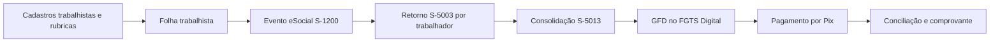

# FGTS Digital: decisão de arquitetura do MVP

Última revisão: 28/07/2026.

## Conclusão executiva

O sistema não deve produzir um PDF próprio e chamá-lo de guia do FGTS. A guia
oficial pagável é a **GFD**, gerada no ambiente FGTS Digital a partir das bases de
remuneração declaradas ao eSocial.

O caminho correto do MVP é:

O fechamento S-1299 não é requisito para o FGTS Digital receber os débitos, mas
é um controle de integridade da competência e deve permanecer no fluxo normal.

## Correção de escopo

O motor atual homologa apenas a categoria eSocial `701`, contribuinte
individual/autônomo em geral. Essa categoria não produz depósito mensal de FGTS.
Ela pertence ao fluxo já implementado de retenção previdenciária, IRRF e
DCTFWeb/DARF.

Para não gerar obrigações indevidas, o primeiro corte do módulo FGTS homologa:

| Categoria | Cenário | Alíquota do MVP |
|---|---|---:|
| `101` | Empregado em geral | 8% |
| `103` | Empregado aprendiz | 2% |
| `721` | Diretor não empregado, com FGTS | 8% |

Outras categorias são bloqueadas até validação específica. A alíquota e a base
não podem ser inferidas apenas pelo nome do cadastro.

## Emissão oficial e automação possível

### O que pode ser automatizado

- formar, validar e versionar eventos do eSocial;
- assinar e transmitir eventos pelo Web Service oficial com certificado
  ICP-Brasil;
- consultar protocolo, recibo, rejeições e totalizadores;
- reconciliar a base interna por trabalhador com S-5003 e S-5013;
- abrir o fluxo operacional para o responsável emitir a GFD;
- registrar a GFD oficial, o hash do documento, o valor, o vencimento, o Pix e o
  comprovante de pagamento;
- impedir homologação se a soma oficial divergir da folha.

### O que não possui canal público confirmado

A documentação pública consultada oferece interface web para gerar a GFD. Não
foi localizada API pública oficial do FGTS Digital para um ERP gerar a GFD e
obter seu QR Code. Portanto, o MVP será assistido nessa última etapa: transmissão
ao eSocial automatizável, emissão da GFD no portal e importação/conciliação do
documento oficial.

Automação de navegador do portal não será tratada como integração estável: pode
quebrar com autenticação, assinatura, CAPTCHA ou mudanças de tela e não substitui
um contrato oficial de API.

## Estratégia de integração

O domínio usa a interface `ProvedorEsocial`, sem conhecer fornecedor:

1. **Modo assistido**, para homologar dados e operar pelo portal durante o piloto.
2. **Web Service oficial**, preferencialmente por um serviço isolado que assina
   XML, usa mTLS e controla certificados.
3. **Provedor comercial**, se custo, suporte e SLA forem melhores do que manter a
   comunicação fiscal internamente.

Alternativas avaliadas:

| Alternativa | Uso recomendado | Observação |
|---|---|---|
| `erpbrasil/esociallib` | prova de conceito e possível serviço Python | MIT e baseada nos XSD oficiais, mas ainda jovem e com pouca adoção pública; exige homologação própria |
| `nfephp-org/sped-esocial` | referência madura para PHP | possui adoção, mas adicionaria outra stack e a release está atrás das mudanças recentes |
| TecnoSpeed eSocial | candidato comercial | API/componente com geração, assinatura, transmissão e suporte; requer proposta, sandbox e validação contratual |
| RESocial | candidato comercial secundário | API REST documentada, mas requer diligência de empresa, SLA, segurança, preço e prova em produção restrita |

Nenhuma dependência será incorporada ao núcleo antes de um _spike_ no ambiente
de produção restrita.

A migração `0029_fgts-digital-foundation` persiste essa separação em quatro
estruturas auditáveis:

- `fgts_apuracao`: versão da competência e conciliação com S-5013;
- `fgts_apuracao_item`: cálculo e S-5003 por trabalhador/tipo de valor;
- `integracao_esocial_evento`: payload, hash, protocolo, recibo e retorno;
- `fgts_guia`: metadados e hash da GFD oficial e de seu comprovante.

## Dados mínimos que ainda faltam

O cadastro de prestador não deve ser reaproveitado silenciosamente como contrato
de emprego. O módulo trabalhista precisa, no mínimo:

- pessoa e CPF;
- matrícula e categoria eSocial;
- tipo de vínculo e data de admissão;
- estabelecimento e lotação tributária;
- cargo/função e CBO quando aplicável;
- salário e jornada contratual;
- rubricas com natureza e códigos de incidência do eSocial, inclusive FGTS;
- eventos cadastrais já aceitos pelo eSocial ou seus recibos;
- certificado A1/A3 ou provedor autorizado;
- procuração eletrônica, quando a transmissão não ocorrer pelo próprio
  empregador.

## Critério de pronto do MVP

Uma competência só está pronta para pagamento quando:

1. todos os trabalhadores elegíveis possuem contrato e rubricas completos;
2. a folha foi fechada e congelada;
3. os eventos de remuneração foram aceitos;
4. S-5003 por trabalhador fecha com a memória interna;
5. S-5013 fecha com a soma dos S-5003;
6. a GFD oficial foi emitida e confere com a apuração;
7. o documento e o comprovante possuem hash e rastreabilidade;
8. eventual retificação mantém a versão anterior.

## Fontes oficiais

- [Manual do FGTS Digital](https://www.gov.br/trabalho-e-emprego/pt-br/servicos/empregador/fgtsdigital/manual-e-documentacao-tecnica/manual/)
- [Origem da base de dados do FGTS Digital](https://www.gov.br/trabalho-e-emprego/pt-br/servicos/empregador/fgtsdigital/conheca-o-fgts-digital/origem-da-base-de-dados)
- [Perguntas frequentes do FGTS Digital](https://www.gov.br/trabalho-e-emprego/pt-br/servicos/empregador/fgtsdigital/perguntas-frequentes)
- [Emissão da GFD](https://www.gov.br/pt-br/servicos/emissao-de-guia-para-recolhimento-do-fgts-atraves-do-fgts-digital)
- [Documentação técnica do eSocial](https://www.gov.br/esocial/pt-br/documentacao-tecnica)
- [Tabela 01 de categorias do eSocial](https://www.gov.br/esocial/pt-br/documentacao-tecnica/leiautes-esocial-versao-s-1-3-nt-06-2026/tabelas.html)
