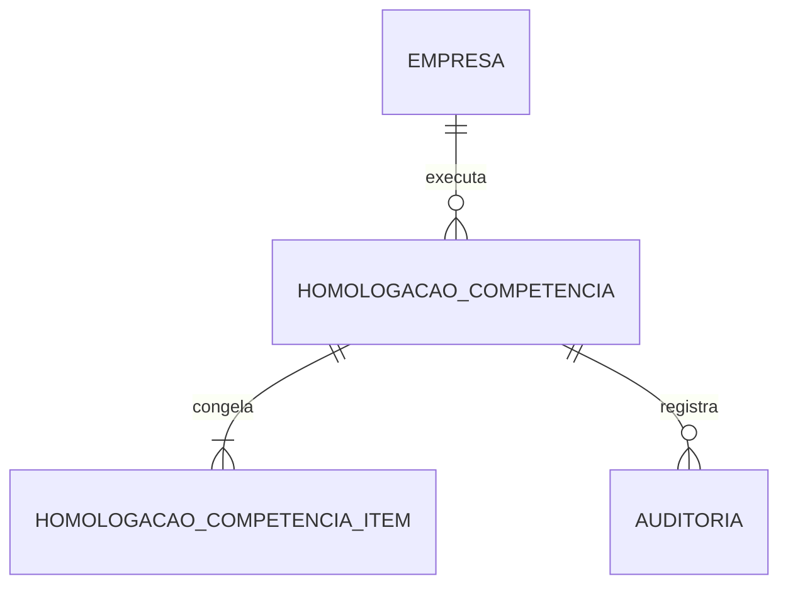

# Homologação mensal e execução paralela

## Objetivo

A rota `/homologacoes` reúne em um único dossiê os controles necessários para
homologar uma competência e conduzir o período paralelo antes do corte do GIW. Ela não
repete cálculos: lê as evidências produzidas pelos módulos operacionais, classifica a
prontidão e congela uma versão reproduzível.

A tela acompanha automaticamente três competências, terminando no mês escolhido. Uma
competência só aparece como aprovada quando:

1. os oito controles vivos estão conformes;
2. existe uma versão congelada com o mesmo hash;
3. um responsável registrou a aprovação final com justificativa.

## Os oito controles

| Controle | Evidência exigida | Ausência |
|---|---|---|
| Medições | Toda medição mensal obrigatória existe, possui valor, evidência e conferente. | Não aplicável quando nenhum Vínculo exige medição. |
| Consolidação | Todo conflito atual possui caso resolvido e, quando exige rateio/unificação, simulação fiscal homologada com fontes e parâmetros ainda vigentes. | Não aplicável quando não há pessoa multi-lote. |
| Folhas | Existe uma Folha fechada para cada combinação ativa de Termo e Meta. | Bloqueia a homologação. |
| Conferência do RH | Cada Folha atual possui aprovação correspondente à revisão e ao hash fechados. | Bloqueia a homologação. |
| Paralelo GIW | Cada Folha atual possui comparação conciliada com arquivo GIW/RH. | Permanece pendente. |
| Pagamentos | Cada item pertence a Folha fechada e possui agência, número e tipo de conta válidos no snapshot. | Bloqueia a homologação. |
| Obrigação | A obrigação previdenciária está apurada ou emitida, sem diferença. | Bloqueia a homologação. |
| Documentos DCTFWeb | Totalizador, recibo e DARF estão verificados; a obrigação está emitida. | Permanece pendente. |

`NAO_APLICAVEL` é um resultado calculado, não uma dispensa manual. Todos os oito itens
permanecem obrigatórios no checklist.

## Versionamento

Cada diagnóstico produz:

- um hash SHA-256 para cada controle;
- contagens de total, conformes e pendentes;
- detalhes JSON das fontes;
- um hash SHA-256 global da competência;
- resumo com prontidão e lista de bloqueios.

O botão **Congelar os oito controles** materializa
`homologacao_competencia` e seus itens imutáveis em
`homologacao_competencia_item`. Repetir a operação com as mesmas fontes é idempotente.
Uma mudança em qualquer controle cria nova versão e invalida as anteriores.

Se um conjunto histórico idêntico reaparecer, a versão é reativada como `PENDENTE` e
precisa de nova decisão. A auditoria mantém a decisão que existia antes da invalidação.

## Estados

- `PENDENTE`: versão congelada sem tratamento;
- `EM_ANALISE`: responsável iniciou a revisão;
- `APROVADA`: oito controles conformes e decisão final registrada;
- `REJEITADA`: competência formalmente recusada com justificativa;
- `INVALIDADA`: ao menos uma fonte não corresponde mais ao hash.

Aprovação é revalidada dentro da transação. Se as fontes mudarem entre a abertura da
tela e o envio do formulário, o servidor invalida a versão em vez de aceitar uma
assinatura obsoleta. Uma versão aprovada pode voltar para análise com justificativa,
sem apagar o histórico.

## Integridade e concorrência

O PostgreSQL garante:

- competência no primeiro dia do mês;
- versão positiva e única por organização/competência;
- hash único por organização/competência;
- estados e tipos enumerados;
- decisão final com responsável, justificativa e instante;
- contagens consistentes;
- itens sem alteração ou exclusão;
- versões sem exclusão física;
- referências sempre restritas à organização;
- auditoria automática de inserções e mudanças.

A materialização usa transação `REPEATABLE READ` e trava consultiva por organização e
competência. Duas solicitações concorrentes não criam versões diferentes para a mesma
fotografia lógica.

## Dossiê CSV

A exportação contém uma linha por controle, com:

- competência, versão e hash global;
- estado, responsável, instante e justificativa;
- tipo e estado do controle;
- total, conformes e pendentes;
- hash da evidência;
- detalhes congelados em JSON.

O arquivo neutraliza fórmulas de planilha e fornece o SHA-256 completo no cabeçalho
HTTP. Ele pode ser arquivado com as evidências do RH e da contabilidade.

## Procedimento para cada competência

1. Finalizar cadastros, medições e casos de consolidação.
2. Gerar e homologar as simulações fiscais exigidas pelos casos multi-vínculo.
3. Processar, conferir e fechar todas as Folhas.
4. Importar a referência do GIW/RH em cada Folha e resolver divergências.
5. Apurar a obrigação e registrar os documentos verificados.
6. Abrir `/homologacoes` e recalcular o diagnóstico.
7. Corrigir todo item `PENDENTE` ou `BLOQUEIO`.
8. Congelar os oito controles.
9. Registrar a versão como `EM_ANALISE`.
10. Conferir o CSV do dossiê e as evidências externas.
11. Aprovar ou rejeitar com responsável e justificativa.

## Critério da campanha de corte

O sistema está tecnicamente pronto para propor o corte quando as três competências da
campanha estiverem simultaneamente:

- com oito controles conformes;
- congeladas em versões que ainda correspondem às fontes atuais;
- aprovadas pelo RH;
- reconciliadas com os documentos reais;
- acompanhadas de backup restaurável e plano de reversão.

O indicador não executa o corte automaticamente. A decisão administrativa continua
externa e deve considerar treinamento, janela operacional, contingência e responsáveis.
