# Modelo de dados

## Modelo implementado

As migrações Drizzle criam 55 tabelas, agrupadas em:

- organização e acesso: `empresa`, `usuario`, `usuario_empresa`;
- pessoas: `pessoa`, `pessoa_endereco`, `pessoa_conta_bancaria`, `dependente`,
  `prestador`;
- contratos: `atividade`, `lotacao`, `termo`, `termo_meta`,
  `prestador_vinculo`;
- cálculo e parâmetros: `evento`, `lancamento_evento_recorrente`,
  `regra_calculo_versao`, `enquadramento_previdenciario`, `medicao_mensal`,
  `contribuicao_outra_fonte`;
- folha: `folha`, `folha_item`, `folha_item_evento`,
  `folha_status_historico`, `folha_conferencia`, `folha_homologacao`,
  `folha_homologacao_item`;
- obrigação: `obrigacao_fiscal`, `obrigacao_fiscal_folha`,
  `obrigacao_fiscal_item`, `obrigacao_fiscal_documento`;
- demonstrativo financeiro: `demonstrativo_mensal`, `pagamento_prestador`,
  `pagamento_retencao`, `demonstrativo_obrigacao`,
  `classificacao_operacional_legado`;
- FGTS e eSocial: `fgts_apuracao`, `fgts_apuracao_item`,
  `integracao_esocial_evento`, `fgts_guia`;
- migração: `importacao_execucao`, `importacao_registro`, `legado_chave`,
  `legado_folha`, `legado_folha_item`, `legado_folha_item_rubrica`,
  `legado_guia_inss`;
- operação: `auditoria`, `tarefa_processamento`;
- homologação mensal: `consolidacao_mensal_caso`,
  `consolidacao_mensal_fonte`, `homologacao_competencia`,
  `homologacao_competencia_item`, `consolidacao_fiscal_simulacao`,
  `consolidacao_fiscal_simulacao_fonte`.

As três estruturas de importação guardam a execução, a decisão por registro e a
correspondência durável entre o código do GIW e o UUID local. Isso permite simular,
reexecutar e auditar a migração sem duplicar cadastros.

A migração `0003` adiciona restrições de domínio para documentos, vigências, valores
não negativos, competência no primeiro dia do mês, consistência dos totais da folha e
da obrigação e estados da importação. Essas regras protegem o banco inclusive quando
uma gravação não passa pela interface web.

```mermaid
erDiagram
  EMPRESA ||--o{ ATIVIDADE : possui
  EMPRESA ||--o{ LOTACAO : possui
  ATIVIDADE ||--o{ PRESTADOR_VINCULO : classifica
  LOTACAO ||--o{ PRESTADOR_VINCULO : aloca
  EMPRESA ||--o{ EVENTO : configura
  PRESTADOR_VINCULO ||--o{ LANCAMENTO_EVENTO_RECORRENTE : recebe
  EVENTO ||--o{ LANCAMENTO_EVENTO_RECORRENTE : aplica
  PESSOA ||--o| PESSOA_ENDERECO : reside
  PESSOA ||--o| PESSOA_CONTA_BANCARIA : recebe
  PESSOA ||--o{ DEPENDENTE : declara
  PESSOA ||--o{ CONSOLIDACAO_MENSAL_CASO : exige
  CONSOLIDACAO_MENSAL_CASO ||--|{ CONSOLIDACAO_MENSAL_FONTE : congela
  PRESTADOR_VINCULO ||--o{ CONSOLIDACAO_MENSAL_FONTE : origina
  CONSOLIDACAO_MENSAL_CASO ||--o{ CONSOLIDACAO_FISCAL_SIMULACAO : autoriza
  PESSOA ||--o{ CONSOLIDACAO_FISCAL_SIMULACAO : agrega
  CONSOLIDACAO_FISCAL_SIMULACAO ||--|{ CONSOLIDACAO_FISCAL_SIMULACAO_FONTE : rateia
  PRESTADOR_VINCULO ||--o{ CONSOLIDACAO_FISCAL_SIMULACAO_FONTE : compoe
  EMPRESA ||--o{ HOMOLOGACAO_COMPETENCIA : executa
  HOMOLOGACAO_COMPETENCIA ||--|{ HOMOLOGACAO_COMPETENCIA_ITEM : verifica
  EMPRESA ||--o{ FGTS_APURACAO : apura
  FGTS_APURACAO ||--|{ FGTS_APURACAO_ITEM : individualiza
  PESSOA ||--o{ FGTS_APURACAO_ITEM : identifica
  FGTS_APURACAO ||--o{ INTEGRACAO_ESOCIAL_EVENTO : transmite
  FGTS_APURACAO ||--o{ FGTS_GUIA : reconcilia
  EMPRESA ||--o{ IMPORTACAO_EXECUCAO : executa
  IMPORTACAO_EXECUCAO ||--o{ IMPORTACAO_REGISTRO : detalha
  IMPORTACAO_EXECUCAO ||--o{ LEGADO_CHAVE : atualiza
  EMPRESA ||--o{ LEGADO_FOLHA : preserva
  LEGADO_FOLHA ||--|{ LEGADO_FOLHA_ITEM : detalha
  LEGADO_FOLHA_ITEM ||--o{ LEGADO_FOLHA_ITEM_RUBRICA : explica
  EMPRESA ||--o{ LEGADO_GUIA_INSS : preserva
  EMPRESA ||--o{ DEMONSTRATIVO_MENSAL : consolida
  DEMONSTRATIVO_MENSAL ||--o{ PAGAMENTO_PRESTADOR : apresenta
  PRESTADOR o|--o{ PAGAMENTO_PRESTADOR : recebe
  PAGAMENTO_PRESTADOR ||--o{ PAGAMENTO_RETENCAO : sofre
  DEMONSTRATIVO_MENSAL ||--o{ DEMONSTRATIVO_OBRIGACAO : inclui
  OBRIGACAO_FISCAL ||--o{ DEMONSTRATIVO_OBRIGACAO : recolhe
```



Esse recorte sustenta a cadeia operacional do MVP. A Folha PF, o pagamento ao
prestador, a retenção e a guia possuem limites próprios; o detalhamento está em
[Demonstrativo mensal de Camamu](DEMONSTRATIVO_MENSAL_CAMAMU.md). O rateio já pode ser simulado,
versionado e homologado, mas continua propositalmente fora do processamento produtivo
da Folha até a validação com competências reais. O núcleo FGTS já preserva apuração
individual, retornos eSocial e GFD, mas o contrato trabalhista e a transmissão real
ainda serão ligados após a homologação dos dados do RH.

## Modelo completo de referência

Consulte:

- [`referencia/modelo-relacional-completo.md`](referencia/modelo-relacional-completo.md): UML, descrição e obrigatoriedade;
- [`referencia/schema-mvp-completo.sql`](referencia/schema-mvp-completo.sql): SQL-base completo;
- [`referencia/ajustes-engenharia-reversa.sql`](referencia/ajustes-engenharia-reversa.sql): extensões descobertas nas três competências.

## Regras de modelagem

1. UUID para identificadores de domínio.
2. Dinheiro em `numeric(18,2)`, nunca ponto flutuante no banco.
3. Competência armazenada no primeiro dia do mês.
4. Chaves e índices sempre incluem organização quando aplicável.
5. Dados de cálculo fechados usam snapshot e hash.
6. Alterações de estado possuem tabela histórica.
7. Migrações aplicadas não são reescritas; correções geram nova migração.
8. Parcelas previdenciárias precisam de tipo, base, alíquota, código e origem.

## Próximas extensões prioritárias

- contrato de trabalho separado do prestador autônomo;
- estabelecimentos, lotações tributárias, cargos e rubricas eSocial;
- ligação da folha trabalhista aos itens de apuração FGTS;
- adaptador de transmissão aprovado em produção restrita;
- importação estruturada de S-5003, S-5013, GFD e comprovante;
- inclusão do FGTS no fechamento mensal.

## Migrações

Após alterar `db/schema.ts`:

```bash
npm run db:generate
```

Revise o SQL gerado antes de aplicar:

```bash
npm run db:migrate
```

Mudanças destrutivas exigem plano de migração, backup e revisão adicional.
