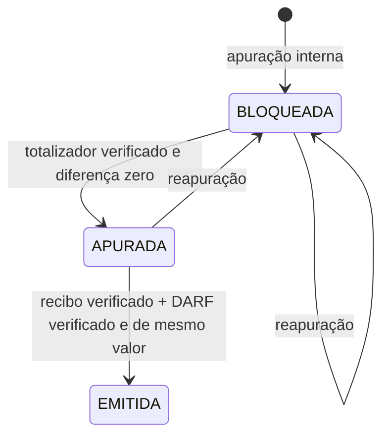

# Obrigação previdenciária e conciliação documental

## Objetivo

Transformar Folhas fechadas em uma apuração previdenciária rastreável e impedir que
uma obrigação parcial, desatualizada ou divergente seja tratada como emitida.

O sistema não transmite declarações nem gera um documento oficial no lugar do portal.
Ele produz o espelho interno, registra as evidências externas e controla a conciliação
com totalizador, recibo e DARF.

## Pré-condições

Para apurar uma competência:

- deve existir pelo menos uma Folha fechada com itens;
- todas as Folhas não canceladas da competência precisam estar fechadas;
- cada item deve possuir enquadramento previdenciário congelado;
- a Folha deve ter revisão e hash válidos;
- o cenário multi-lote por pessoa deve respeitar o bloqueio descrito em
  [Consolidação mensal](CONSOLIDACAO_MENSAL.md).

A apuração parcial é recusada. Isso evita que um total provisório coincida com um
documento externo e seja liberado indevidamente.

## Composição atual

| Natureza | Origem | Base e alíquota |
|---|---|---|
| `SEGURADO` | Retenção calculada no item da Folha | Base limitada e alíquota recuperada da memória congelada do segurado. |
| `PATRONAL` | Enquadramento previdenciário da Folha | Base previdenciária bruta e alíquota patronal da versão congelada. |

RAT, terceiros, compensações, acréscimos e demais categorias somente devem ser
incluídos após enquadramento e evidência específicos. A ausência dessas parcelas
permanece indicada no bloqueio operacional; não é preenchida por presunção.

## Integridade das fontes

`obrigacao_fiscal_folha` preserva o identificador, a revisão e o SHA-256 de cada
Folha utilizada. Antes de aceitar um documento marcado como verificado, o sistema
confere:

1. se todas as fontes vinculadas continuam fechadas;
2. se revisão e hash continuam iguais aos congelados;
3. se apareceu uma nova Folha fechada depois da apuração;
4. se ainda existe alguma Folha pendente na competência.

Qualquer mudança exige reapuração. Reapurar desmarca documentos anteriormente
verificados e registra a invalidação no conteúdo auditável; nenhum recibo ou
totalizador antigo continua liberando a obrigação recalculada.

## Máquina de estados

O DARF é confirmado somente quando existe totalizador verificado e conciliado,
recibo verificado e igualdade de valor. Registrar um arquivo sem marcar a conferência
preserva a evidência, mas não muda o estado.

## Espelho CSV

Cada obrigação oferece **Espelho CSV**, contendo:

- competência, tipo e estado;
- lote, revisão e hash da Folha;
- Termo, Meta, matrícula e prestador;
- natureza, origem, descrição, base, alíquota e valor;
- principal, juros, multa, total, valor declarado e diferença;
- referências, datas, valores, hashes e situação dos documentos.

O arquivo usa separador `;`, moeda brasileira e proteção contra fórmulas de planilha.
A resposta HTTP inclui `X-Content-SHA256` para conferência do conteúdo baixado.

## Roteiro operacional

1. Fechar todas as Folhas da competência após aprovação do RH.
2. Executar **Apurar competência**.
3. Baixar o espelho e conferir população, bases, alíquotas e totais.
4. Comparar com os eventos enviados e o totalizador oficial.
5. Registrar o totalizador como verificado; divergência mantém o bloqueio.
6. Registrar o recibo verificado.
7. Registrar o DARF verificado com o mesmo total.
8. Guardar localizador e SHA-256 dos documentos no repositório documental interno.

Se uma Folha for criada, reaberta ou alterada, reapure antes de continuar.

Obrigações ainda não emitidas podem ser canceladas com justificativa. O cancelamento
invalida documentos verificados e preserva itens e totais como evidência. Obrigação
emitida exige procedimento fiscal de retificação e não aceita cancelamento direto.
Consulte [Cancelamentos e retificações](CANCELAMENTOS_E_RETIFICACOES.md).

## Critério de homologação

Antes do uso financeiro real, três competências devem demonstrar:

- mesma população e mesmas bases entre Folha, espelho e totalizador;
- alíquotas coerentes com o enquadramento congelado;
- diferenças explicadas e aprovadas;
- documentos recuperáveis pelos localizadores;
- reapuração invalidando corretamente evidências anteriores;
- restauração do banco preservando fontes, hashes e estados.
