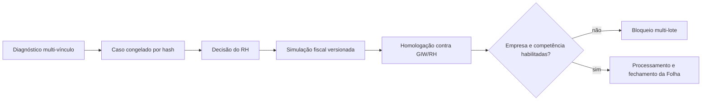
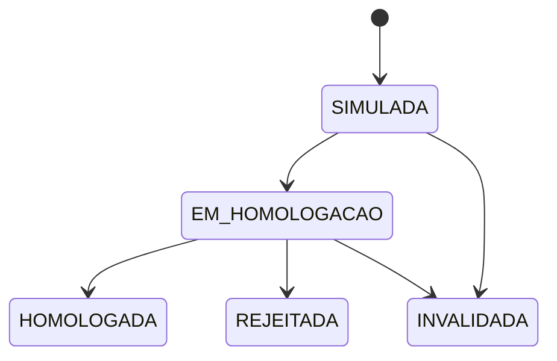

# Simulação fiscal consolidada

## Objetivo

Calcular INSS e IRRF uma única vez por pessoa e competência quando a remuneração está
distribuída em mais de um Vínculo, Termo, Meta ou lote. O resultado é rateado de forma
determinística entre as fontes para permitir conferência centavo a centavo com o GIW e
com os documentos do RH.

Esta capacidade opera em **modo controlado**. Uma simulação `HOMOLOGADA` somente
alimenta a Folha quando o operador habilita explicitamente uma empresa e uma
competência inicial. O recurso permanece desativado por padrão e a homologação, sozinha,
não produz efeito financeiro.

## Cadeia operacional

1. `/consolidacoes` detecta a mesma Pessoa em múltiplos Vínculos.
2. O operador congela as fontes; o RH decide `RATEIO_NECESSARIO` ou
   `UNIFICAR_VINCULOS`.
3. `/consolidacoes/simulacoes` recarrega Vínculos, medições, Eventos, dependentes,
   outras fontes, regra fiscal e enquadramento previdenciário.
4. O motor calcula a base mensal da Pessoa e rateia os resultados.
5. A versão é encaminhada ao RH e pode ser homologada, rejeitada ou invalidada.
6. O espelho CSV preserva hashes, totais e valores por Vínculo.

## Hipótese de cálculo

O motor:

- soma as bases previdenciárias dos Vínculos elegíveis;
- aplica uma única vez a base comprovada em outras fontes;
- aplica o teto previdenciário ao agregado;
- calcula o INSS da Pessoa uma única vez;
- soma os rendimentos sujeitos ao IRRF;
- deduz uma única vez o INSS consolidado e a quantidade de dependentes;
- calcula o IRRF mensal uma única vez;
- distribui base e tributos proporcionalmente às bases de cada Vínculo.

O rateio usa **maior resto**. A parcela inteira é calculada para cada fonte e os
centavos residuais são entregues em ordem decrescente do resto; empates são resolvidos
pelo UUID do Vínculo. Portanto:

- a soma das parcelas é exatamente igual ao total;
- a ordem recebida das fontes não muda o resultado;
- repetir a mesma entrada produz o mesmo hash;
- não existe arredondamento oculto por ponto flutuante.

Essa distribuição é uma hipótese técnica para homologação, não uma interpretação
normativa já confirmada para todos os contratos e eventos de pagamento.

## Persistência

### `consolidacao_fiscal_simulacao`

Guarda Pessoa, competência, caso, versão, estado, regra, enquadramento, quatro hashes,
totais consolidados e memória completa.

### `consolidacao_fiscal_simulacao_fonte`

Guarda cada Vínculo, medição, Folha existente, entrada congelada, hash próprio, bases
brutas, parcelas rateadas, totais e snapshot da memória individual.

As fontes não aceitam alteração ou exclusão. O conteúdo calculado do cabeçalho também é
imutável; qualquer mudança exige nova versão. Decisões terminais não podem ser reabertas.
Criação e decisão usam transação `SERIALIZABLE` e trava consultiva por organização,
Pessoa e competência; concorrência detectada retorna erro repetível em vez de gravar
duas versões ambíguas.

## Estados

Antes de encaminhar ou homologar, o servidor recalcula os hashes das fontes, da regra e
do enquadramento. Divergência exige nova versão. Homologação, rejeição e invalidação
exigem responsável, justificativa e instante.

## Bloqueios

A simulação é recusada quando:

- o caso não está resolvido ou foi classificado como não aplicável;
- as fontes do diagnóstico mudaram;
- existe medição mensal obrigatória ausente;
- há comprovante de outra fonte ainda não verificado;
- categoria, dependentes, enquadramento ou comprovantes divergem entre os Vínculos;
- a Pessoa possui menos de dois Vínculos no caso;
- o cálculo produz líquido negativo;
- regra, enquadramento ou entradas mudam antes da decisão.

## Homologação necessária

Para liberar o consumo desse agregado pela Folha:

1. importar três competências completas do GIW;
2. comparar proventos, bases, INSS, IRRF, descontos e líquido por Pessoa e Vínculo;
3. classificar toda diferença de fórmula, competência, arredondamento ou cadastro;
4. validar com RH e assessoria contábil a hipótese de rateio;
5. confirmar o tratamento dos Eventos e das datas de pagamento;
6. aprovar as três competências no dossiê mensal;
7. registrar a empresa e a competência inicial nas três variáveis de ativação;
8. reiniciar web e worker e executar o smoke produtivo multi-vínculo;
9. repetir testes de regressão, obrigação previdenciária e retificação.

## Garantias do consumo produtivo

- empresa e competência são delimitadas por configuração, sem liberação global;
- ausência de simulação homologada mantém o bloqueio;
- mudança de fonte, regra, enquadramento ou composição de Vínculos invalida o consumo;
- proventos e descontos de Eventos são recalculados e comparados antes do rateio;
- apenas INSS, IRRF, bases e totais fiscais recebem as parcelas homologadas;
- cada item registra o ID e o hash da simulação;
- o fechamento exige Folha para todos os Vínculos ativos da Pessoa;
- o CI executa duas Folhas sintéticas, processa pelo worker, aprova, fecha e confere que
  a soma de INSS/IRRF coincide centavo a centavo com o agregado homologado.

## Validação automatizada

Os testes cobrem rateio exato, resíduos, ordem independente, uma fonte equivalente ao
motor individual, múltiplas fontes, teto, outras fontes, dependentes, contextos
incompatíveis, máquina de estados, exportação e restrições do PostgreSQL. O CI aplica
todas as migrações em PostgreSQL 16; sem `DATABASE_URL`, os testes de integração são
marcados como ignorados.
