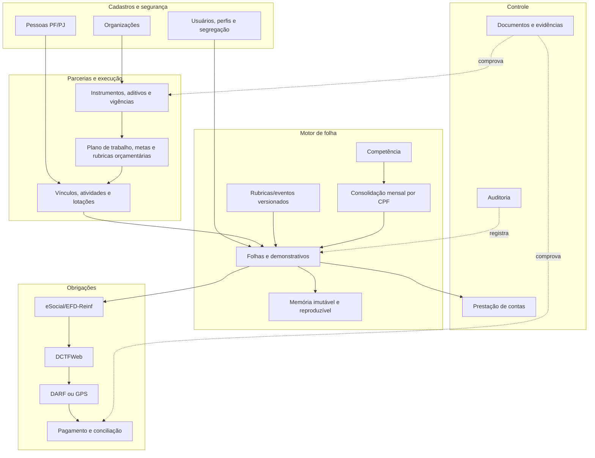

# Diagnóstico de engenharia reversa e roteiro de substituição

## 1. Conclusão executiva

É viável substituir o sistema por uma solução mais moderna sem depender de uma cópia literal. Para o recorte **folha de prestadores + apuração previdenciária**, o nível atual de conhecimento é estimado em **88/100**. Com os documentos de origem, contrato, exportação controlada de dados e três ciclos de execução paralela, a confiança pode chegar a **95–97/100** para esse MVP.

Para o **sistema completo**, a confiança atual é menor, estimada em **62/100**, porque módulos de empenho, prestação de contas, produtividade, contratos, relatórios, permissões e exceções ainda não foram cobertos longitudinalmente.

Chegar a 100% de identidade interna por observação externa não é uma promessa tecnicamente honesta: não temos o código-fonte, o esquema físico original, todos os dados históricos nem todos os casos excepcionais. O objetivo correto é obter **100% de cobertura dos requisitos aceitos e das regras testadas**, com rastreabilidade e resultados reconciliados, mesmo que a arquitetura interna seja diferente e melhor.

Nenhum cadastro foi alterado durante a inspeção. Os dados pessoais encontrados foram tratados apenas para análise e não são reproduzidos neste documento.

## 2. O que já foi comprovado no sistema

### 2.1 Arquitetura e cadeia funcional

O sistema é uma aplicação web Java baseada em ações `.do`, com interface composta por múltiplos `iframe`s e formulários gerados por plataforma low-code. A cadeia observada é:


Foram identificados cadastros e operações de empresa, usuários, pessoas físicas e jurídicas, parceiros, prestadores, dependentes, atividades, lotações, termos, metas, eventos, produtividade, folha, empenho, prestação de contas, guia previdenciária, recibos e relatórios.

### 2.2 Estruturas físicas e campos confirmados

O lote de folha utiliza, entre outros, identificadores de empresa, competência, termo, processo/meta, número, tipo e estado. Seu ciclo mantém datas e usuários de montagem, fechamento/armazenamento e reabertura.

A memória individual conserva dados cadastrais e bancários em forma de fotografia da competência, além dos seguintes resultados de cálculo:

- base de retribuição;
- base, valor bruto, redução e valor final de IRRF;
- desconto simplificado de IRRF;
- base e valor de INSS;
- bases de salário-família e auxílio-tributos;
- totais de proventos, descontos e líquido;
- atividade, lotação, carga horária, admissão, desligamento e data de crédito.

Os eventos têm natureza de provento ou desconto, modo de cálculo, composição e incidências independentes para INSS, IRRF, salário-família e auxílio-tributos. Foram encontrados eventos de retribuição, INSS, IRRF, complemento, plantão, insalubridade, horas extras, faltas, desconto e arredondamento.

### 2.3 Três competências analisadas

Foram percorridas integralmente três folhas mensais consecutivas do mesmo termo/meta, cada uma com 37 registros. Os números abaixo são agregados e não contêm identificação pessoal:

| Competência | Prestadores | Proventos | INSS retido | IRRF retido | Descontos | Líquido | Linhas da guia | Total exibido na guia |
|---|---:|---:|---:|---:|---:|---:|---:|---:|
| abr/2026 | 37 | R$ 221.686,76 | R$ 8.191,83 | R$ 789,95 | R$ 8.981,78 | R$ 212.704,98 | 52 | R$ 16.383,66 |
| mai/2026 | 37 | R$ 221.523,22 | R$ 8.173,29 | R$ 789,95 | R$ 8.963,24 | R$ 212.559,98 | 52 | R$ 16.346,58 |
| jun/2026 | 37 | R$ 227.435,32 | R$ 8.576,14 | R$ 2.049,33 | R$ 10.625,47 | R$ 216.809,85 | 52 | R$ 17.152,28 |

Em cada mês, 26 registros tiveram retenção previdenciária e 11 ficaram sem base de INSS e IRRF. A natureza jurídica ou causa de isenção desses 11 casos precisa ser confirmada documentalmente; não deve ser deduzida apenas pelo resultado da tela.

### 2.4 Regras de cálculo demonstradas

#### INSS do contribuinte individual

Nos casos tributados, o legado aplica 11% sobre a base contributiva, limitado ao valor mensal parametrizado. Para 2026, o sistema contém limite de contribuição de R$ 932,31, correspondente a 11% do teto de R$ 8.475,55. A retenção de 11% do contribuinte individual que presta serviços a empresa e a necessidade de considerar múltiplas fontes pagadoras são compatíveis com as orientações da [Receita Federal sobre contribuições previdenciárias da pessoa física](https://www.gov.br/receitafederal/pt-br/assuntos/orientacao-tributaria/tributos/contribuicoes-previdenciarias-pf) e da [pessoa jurídica](https://www.gov.br/receitafederal/pt-br/assuntos/orientacao-tributaria/tributos/contribuicoes-previdenciarias-pj).

Regra-alvo preliminar:

```text
base_inss_residual = max(0, teto_competencia - bases_concomitantes_comprovadas)
base_inss_item     = min(base_tributavel_item, base_inss_residual)
inss_segurado      = arredondar(base_inss_item × 11%, 2)
```

A ordem de alocação entre contratos, arredondamentos e declarações de outras fontes ainda precisa de casos de teste adicionais.

#### IRRF consolidado por CPF

O parâmetro de “conciliar folha individualmente” está ativo. Isso explica memórias nas quais a base de IRRF é maior que a remuneração de um único contrato: o sistema consolida os rendimentos mensais da mesma pessoa em mais de um vínculo antes de calcular e depois distribui o tributo.

Os valores observados são compatíveis com as faixas oficiais de 2026 e com a redução instituída pela Lei nº 15.270/2025. A Receita informa redução que zera o imposto até R$ 5.000 de rendimentos tributáveis mensais e redução decrescente entre R$ 5.000,01 e R$ 7.350; as faixas, deduções, desconto simplificado mensal de até R$ 607,20 e dedução por dependente constam na [tabela oficial do IRPF 2026](https://www.gov.br/receitafederal/pt-br/assuntos/meu-imposto-de-renda/tabelas/2026). A aplicação prática é ilustrada nos [exemplos oficiais da Receita](https://www.gov.br/receitafederal/pt-br/assuntos/meu-imposto-de-renda/tabelas/exemplos-de-aplicacao-da-lei-15-270-2025).

Um caso observado confirma toda a sequência: remuneração de R$ 6.000,03, INSS de R$ 660,00, base de IRRF de R$ 5.340,03, imposto pela faixa de R$ 559,78, redução de R$ 179,75 e retenção final de R$ 380,03.

Regra-alvo preliminar:

```text
rendimentos_cpf = soma dos rendimentos tributáveis internos e externos da competência
deducao_legal   = INSS dedutível + dependentes + demais deduções legais
deducao_usada   = maior benefício entre dedução legal e desconto simplificado vigente
base_irrf       = max(0, rendimentos_cpf - deducao_usada)
irrf_bruto      = aplicar faixa(base_irrf)
reducao_2026    = aplicar redutor sobre os rendimentos tributáveis, conforme a vigência
irrf_final      = max(0, irrf_bruto - reducao_2026 - retenções compensáveis)
```

Essa regra precisa ser versionada por vigência e não escrita como constantes fixas no código.

### 2.5 Achado crítico na guia previdenciária

Nas três competências, o total exibido na guia foi **exatamente o dobro** do INSS retido na folha:

```text
abr: 16.383,66 = 2 × 8.191,83
mai: 16.346,58 = 2 × 8.173,29
jun: 17.152,28 = 2 × 8.576,14
```

Além disso, cada guia contém 52 linhas para 26 prestadores tributados. A inspeção das duas metades da grade confirmou que as linhas 27–52 repetem prestador e valor das linhas 1–26. A interface não identifica essas metades como “segurado” e “patronal”.

Isso pode representar uma regra de negócio específica, uma apresentação inadequada de parcelas distintas ou um defeito do legado. Não é seguro reproduzir a duplicação antes de confrontar:

1. o documento efetivamente pago;
2. o recibo da DCTFWeb/DARF ou GPS, quando aplicável;
3. a contabilização da despesa e da retenção;
4. o contrato, plano de trabalho e regras locais;
5. a explicação do contador responsável.

O novo sistema deverá armazenar cada parcela com tipo explícito — segurado, patronal, RAT/GILRAT, terceiros, juros, multa, compensação ou outra — e impedir duas linhas idênticas sem origem comprovável.

## 3. O módulo não deve nascer preso à antiga “GPS”

O nome funcional recomendado é **Apuração Previdenciária e Obrigações**, mantendo “GPS” apenas como modalidade legada ou excepcional. Para contribuintes obrigados ao eSocial/DCTFWeb, as informações de eSocial e EFD-Reinf alimentam a DCTFWeb, que emite DARF, conforme a [orientação oficial da Receita](https://www.gov.br/receitafederal/pt-br/acesso-a-informacao/perguntas-frequentes/sped/efd-reinf/efdr/1-geral/1-4-como-sera-a) e o [comunicado sobre pagamento pós-eSocial](https://www.gov.br/receitafederal/pt-br/assuntos/orientacao-tributaria/restituicao-ressarcimento-reembolso-e-compensacao/mensagens/cpim/pos_esocial).

O desenho deve comportar:

- demonstrativos por trabalhador/CPF e competência;
- eventos S-1200 e pagamentos S-1210, quando o enquadramento exigir;
- fechamento, recibos, totalizadores e divergências do eSocial;
- débitos apurados na DCTFWeb;
- DARF numerado, pagamento e conciliação;
- GPS apenas para hipóteses legalmente admitidas;
- trilha entre folha, obrigação, transmissão e pagamento.

O Manual Web Geral do eSocial prevê um evento S-1200 por trabalhador e competência, podendo conter demonstrativos de mais de um contrato, o que reforça a consolidação por CPF encontrada no legado. Consulte o [Manual Web Geral](https://www.gov.br/esocial/pt-br/empresas/manual-web-geral) e a [documentação técnica vigente do eSocial](https://www.gov.br/esocial/pt-br/documentacao-tecnica/documentacao-tecnica/).

## 4. Arquitetura-alvo



### Decisões técnicas recomendadas

- **PostgreSQL** com chaves UUID, restrições de integridade, índices por organização/competência e política de isolamento por organização.
- Motor de cálculo determinístico e versionado. Cada processamento aponta para a versão exata das regras e tabelas fiscais.
- Fotografias dos dados usados no cálculo. Alterar hoje um contrato ou conta bancária não pode reescrever a folha fechada de abril.
- Folha fechada imutável. Correções devem ocorrer por reabertura auditada, folha complementar ou estorno, nunca por edição silenciosa.
- Processamento idempotente. Repetir a mesma solicitação não pode duplicar eventos, guia ou pagamento.
- Outbox/fila para integrações externas, com reprocessamento seguro e recibos.
- Arquivos em armazenamento de objetos com hash, versão, classificação e política de retenção.
- Autorização por função e organização, com dupla aprovação para fechamento, reabertura e baixa de tributos.
- Observabilidade: logs estruturados, métricas, correlação de requisições e alertas de divergência.

A LGPD exige medidas técnicas e administrativas aptas a proteger os dados pessoais, inclusive desde a concepção do serviço, conforme o art. 46 da [Lei nº 13.709/2018](https://www.planalto.gov.br/ccivil_03/_ato2015-2018/2018/lei/l13709compilado.htm). Para este sistema isso significa, no mínimo, criptografia, menor privilégio, mascaramento fora de produção, registro de acesso, gestão de incidentes e proibição de usar cópias reais em desenvolvimento sem anonimização.

## 5. Extensões essenciais ao modelo SQL inicial

O esquema inicial continua válido, mas a engenharia reversa mostrou a necessidade destas extensões:

| Estrutura | Obrigatória no MVP | Finalidade |
|---|---|---|
| `regra_calculo_versao` | Sim | Congela fórmula, vigência, fonte legal, parâmetros e hash da regra usada. |
| `folha_status_historico` | Sim | Registra montagem, processamento, fechamento, reabertura, cancelamento e responsável. |
| `folha_consolidacao_pessoa` | Sim | Consolida bases e tributos mensais por CPF, mesmo com vários contratos/folhas. |
| `folha_consolidacao_item` | Sim | Rateia o resultado consolidado entre os vínculos/itens que o originaram. |
| `folha_fonte_concomitante` | Sim | Guarda declaração/comprovante de remuneração e contribuição em outra fonte. |
| novos campos de memória em `folha_item` | Sim | Conserva IRRF bruto, redução, desconto simplificado e bases auxiliares. |
| tipo e origem em `guia_inss_item` | Sim | Distingue segurado, patronal e demais parcelas; evita duplicação ambígua. |
| `obrigacao_fiscal` e vínculo com folhas | Sim | Representa DCTFWeb, DARF ou GPS sem acoplar o produto a um documento antigo. |
| `obrigacao_fiscal_item` | Sim | Reconcilia cada débito com pessoa, base, alíquota, código de receita e origem. |
| `obrigacao_transmissao` | Condicional | Obrigatória se o MVP transmitir/consultar eSocial ou DCTFWeb; dispensável se apenas exportar. |
| `pagamento_tributo` | Não no núcleo | Recomendado logo após a emissão; registra autenticação, principal, acréscimos e conciliação. |
| `documento_evidencia` | Sim | Vincula contrato, declaração, recibo e comprovante com hash e auditoria. |

A migração proposta está em `mvp_folha_inss_ajustes_reversa.sql`.

## 6. Estratégia para chegar a 95–97% de confiança

### Etapa A — formar o dossiê de verdade

Para cada uma das três competências, reunir:

- arquivo/PDF da folha, relação de pagamentos, RPAs e fichas financeiras;
- documento previdenciário efetivamente emitido e comprovante de pagamento;
- recibos e totalizadores de eSocial, EFD-Reinf e DCTFWeb, quando existirem;
- contratos e aditivos dos prestadores, atividades, lotações e valores;
- declarações de contribuição em outras fontes pagadoras;
- cadastro de eventos e parâmetros vigentes;
- lançamentos contábeis e extratos de pagamento;
- contrato do software atual, escopo, anexos, níveis de serviço e regras de exportação/portabilidade.

Os arquivos devem ser recebidos em canal controlado, inventariados, classificados e anonimizados para desenvolvimento.

### Etapa B — especificação executável

Cada regra vira uma ficha contendo entrada, fórmula, arredondamento, vigência, prioridade, exceções, saída e fonte normativa. Essas fichas geram testes automatizados. O legado será o “oráculo” apenas quando seu resultado estiver reconciliado com documento e norma; divergências serão tratadas como achados, não copiadas.

### Etapa C — suíte de testes

1. **Golden master:** importar entradas anonimizadas das três competências e comparar, centavo a centavo, folha, memória e obrigação.
2. **Testes de fronteira:** R$ 0, limites de faixas do IRRF, R$ 5.000, R$ 7.350, teto previdenciário, centavos e competência de mudança de vigência.
3. **Propriedades/invariantes:** proventos − descontos + benefícios = líquido; itens = total da folha; débitos discriminados = obrigação; pagamento não excede saldo sem justificativa.
4. **Casos combinatórios:** PF/PJ, isento, aposentado, dependentes, admissão/desligamento, múltiplos vínculos, outras fontes, folha complementar, reabertura e diferença retroativa.
5. **Teste diferencial:** executar os mesmos dados no legado e no novo sistema, explicando toda diferença.
6. **Segurança:** isolamento entre organizações, perfis, sessão, exportação, auditoria, vulnerabilidades e restauração de backup.
7. **Aceitação:** contador, operador, gestor do instrumento e controle interno assinam cenários e totais.

### Etapa D — operação paralela

Executar ao menos três competências em modo sombra, sem o novo sistema comandar pagamentos. A migração só avança quando:

- 100% dos prestadores e contratos ativos estiverem conciliados;
- todas as diferenças financeiras estiverem zeradas ou formalmente justificadas;
- os documentos externos e a contabilidade fecharem;
- backup, restauração, perfis e auditoria tiverem sido testados;
- houver plano de reversão e período de convivência.

## 7. Roteiro de implementação

| Fase | Entrega | Critério de saída |
|---|---|---|
| 0. Descoberta controlada | inventário, dicionário de dados, fluxos, matriz normativa e dossiê de 3 meses | nenhuma regra crítica sem dono/fonte |
| 1. Fundação | organizações, pessoas, usuários, perfis, instrumentos, metas, vínculos, documentos e auditoria | cadastros importados e reconciliados |
| 2. Motor de cálculo | eventos versionados, competência, consolidação por CPF, folha e memória | golden master aprovado para os 3 meses |
| 3. Obrigações | itens previdenciários tipados, eSocial/exportação, DCTFWeb/DARF ou GPS excepcional | total folha–obrigação–pagamento reconciliado |
| 4. Operação | relatórios, RPA, pagamentos, fechamento/reabertura, alertas e painéis | homologação pelos papéis responsáveis |
| 5. Sombra e corte | 3 competências paralelas, treinamento, migração incremental e contingência | aceite formal e go-live controlado |
| 6. Expansão | produtividade, empenho, execução orçamentária e prestação de contas | módulo a módulo, sem ampliar o núcleo fiscal |

Uma equipe pequena e experiente tende a precisar de aproximadamente 12–18 semanas para um MVP homologável, depois da descoberta e com disponibilidade do contador e dos usuários-chave. Isso é uma estimativa técnica, não um cronograma contratual; integrações governamentais, qualidade da migração e regras locais podem alterar substancialmente o prazo.

## 8. Regras jurídicas e contratuais que precisam entrar na descoberta

O tipo do instrumento define o regime. Parcerias com organizações da sociedade civil podem estar sob a [Lei nº 13.019/2014 — MROSC](https://www.planalto.gov.br/ccivil_03/_ato2011-2014/2014/lei/l13019compilado.htm) e regulamentos locais; contratações administrativas comuns podem envolver a [Lei nº 14.133/2021](https://planalto.gov.br/ccivil_03/_ato2019-2022/2021/lei/l14133.htm). Não se deve misturar automaticamente os dois regimes. O [Decreto nº 8.726/2016](https://planalto.gov.br/ccivil_03/_ato2015-2018/2016/decreto/d8726.htm) regulamenta o MROSC no âmbito federal, mas o município/estado pode ter regulamentação própria.

Na leitura dos contratos, devem ser extraídos:

- objeto, partes, regime jurídico e hierarquia dos anexos;
- obrigações funcionais, relatórios e prazos;
- propriedade, acesso e portabilidade dos dados;
- formato e prazo para entrega do banco e documentos;
- níveis de serviço, disponibilidade, suporte e continuidade;
- segurança, LGPD, suboperadores e incidentes;
- propriedade intelectual e limites de engenharia reversa;
- retenção, auditoria, prestação de contas e encerramento;
- regras de transição, sanções e aceite.

Antes de qualquer extração automatizada em massa, é prudente confirmar autorização contratual, limites de carga, janela de execução e mecanismo oficial de exportação. Engenharia reversa de comportamento e interoperabilidade deve permanecer restrita ao ambiente e aos dados legitimamente autorizados.

## 9. Lacunas e nível de confiança

| Área | Confiança atual | O que falta |
|---|---:|---|
| telas, campos e fluxo principal da folha | 96% | poucos estados excepcionais |
| cadeia cadastral e relacionamentos | 92% | esquema físico/exportação do banco |
| INSS ordinário dos casos observados | 92% | outras fontes, isenções e ordem de rateio |
| IRRF ordinário e redução de 2026 | 94% | dependentes, aposentados, pensão e retroativos |
| fechamento, reabertura e rastreabilidade | 82% | efeitos posteriores e permissões |
| guia/apuração previdenciária | 55% | explicar duplicação e reconciliar com documento oficial |
| eSocial/DCTFWeb/contabilidade | 45% | arquivos, recibos, códigos e integrações reais |
| migração histórica | 20% | exportação, qualidade e volume do banco |
| sistema completo | 62% | aprofundar módulos não-MVP |
| MVP folha + previdenciário | **88%** | dossiê documental e homologação |

## 10. Próximos insumos, em ordem de prioridade

1. As três folhas completas, RPAs/relações de pagamento e respectivas guias ou DARFs com comprovantes.
2. Recibos/totalizadores de eSocial e DCTFWeb das mesmas competências.
3. Contrato do sistema atual, edital/termo de referência, proposta, anexos e aditivos.
4. Instrumento de parceria, plano de trabalho, aditivos e norma local aplicável.
5. Exportação dos parâmetros, eventos, prestadores, vínculos, dependentes, atividades e lotações.
6. Um caso de cada exceção: dependente, aposentado, múltiplas fontes, teto atingido, admissão, desligamento, complemento, reabertura e baixa parcial.
7. Matriz atual de usuários/perfis e lista de relatórios obrigatórios.
8. Se contratualmente possível, dump anonimizado ou views somente leitura do banco legado.

O primeiro ponto de decisão após receber esses arquivos será resolver a duplicação da guia. Depois disso, já é possível congelar a especificação executável do MVP e iniciar uma implementação com risco controlado.
