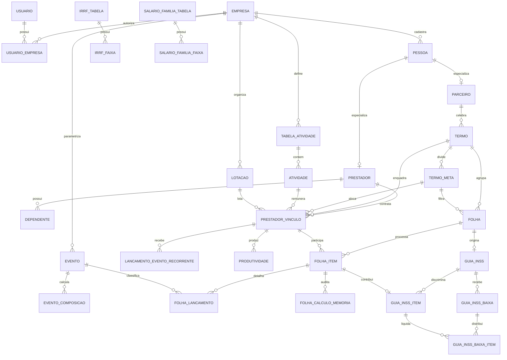
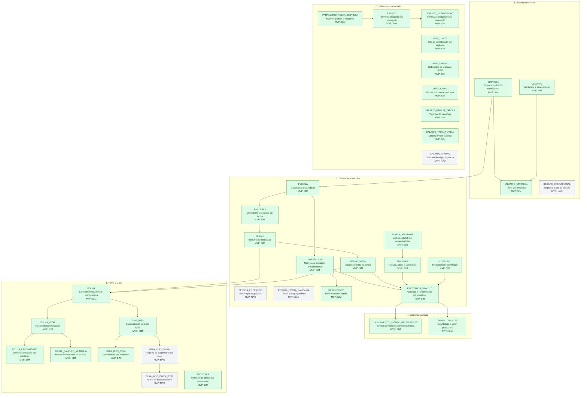
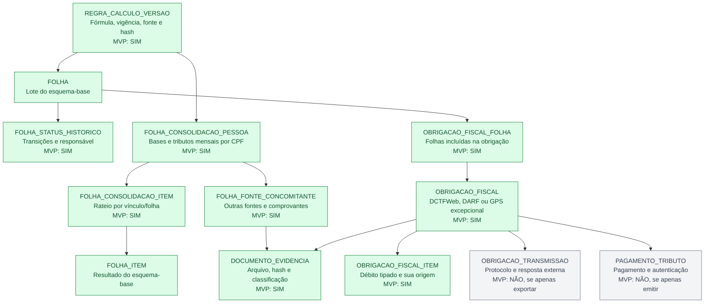

# Modelo de dados — MVP Folha de Pagamento e Guia de INSS

## Decisões principais

- PostgreSQL, UUIDs técnicos e números de negócio separados.
- Isolamento por `empresa_id`; o contexto operacional mantém empresa e ano ativos.
- Pessoa, prestador e parceiro são conceitos diferentes. Um prestador é uma especialização de pessoa.
- O vínculo liga prestador a termo, meta, atividade e lotação e guarda remuneração, carga horária e incidências.
- Eventos possuem tipo, modo de cálculo, composição e bases tributárias.
- Tabelas fiscais são versionadas por vigência. Folhas fechadas mantêm snapshots e memória de cálculo.
- A Guia de INSS nasce de uma folha fechada; seus itens mantêm a contribuição por prestador e as baixas são auditáveis.

## Cadeia operacional

1. Cadastrar empresa, usuários e perfis.
2. Cadastrar parâmetros da empresa e tabelas fiscais por vigência.
3. Cadastrar pessoas, prestadores, dependentes e contas bancárias.
4. Cadastrar parceiro, termo, metas, atividades e lotações.
5. Criar o vínculo contratual do prestador.
6. Configurar eventos e lançamentos recorrentes; lançar produtividade.
7. Abrir e processar a folha, gerando itens, lançamentos, bases e memória.
8. Conferir e fechar a folha.
9. Gerar a Guia de INSS a partir da folha fechada.
10. Registrar baixa individual ou em lote sem apagar o histórico.

## Diagrama ER/UML

## Limite do MVP

Incluído: cadastros-base, vínculos, parâmetros, eventos, produtividade, lançamentos recorrentes, folha, memória de cálculo, INSS por prestador, guia e baixa.

Deixado para fases posteriores: prestação de contas, empenho, recibo, conciliação bancária, assinatura eletrônica, relatórios avançados, eSocial/Reinf/DCTFWeb e integrações bancárias. O modelo já preserva as chaves necessárias para esses módulos.

## Regras que devem ficar na aplicação/serviço de cálculo

- Selecionar parâmetros pela competência e nunca pela data atual.
- Gerar folha de modo idempotente, dentro de transação e com controle de versão.
- Bloquear edição de vínculos, eventos e parâmetros usados por folha fechada; criar nova vigência.
- Guardar snapshots dos eventos e memória de cada cálculo.
- Só gerar guia a partir de folha fechada e impedir duas guias ativas para a mesma folha.
- Não apagar baixas; estornar com novo lançamento auditado.

O arquivo `mvp_folha_inss.sql` contém o DDL correspondente.

## UML anotado por obrigatoriedade

Legenda: verde = necessária para entregar o MVP funcional; cinza = extensão que pode entrar depois sem bloquear o cálculo e a emissão inicial.

## Catálogo detalhado das tabelas

| Tabela | Descrição | Obrigatória no MVP? | Justificativa |
|---|---|:---:|---|
| `empresa` | Representa a organização/tenant que processa a folha e emite a guia. Guarda CNPJ e identificação do contribuinte. | **Sim** | É a raiz do isolamento de dados e da obrigação previdenciária. |
| `usuario` | Identidade do operador, CPF, nome, e-mail, senha protegida e estado de acesso. | **Sim** | Toda operação financeira precisa de autoria. |
| `usuario_empresa` | Liga usuário e empresa e define o perfil Administrador, Operador ou Consulta. | **Sim** | Implementa autorização multiempresa. |
| `sessao_operacional` | Persiste empresa e ano selecionados durante a sessão, além do indicador de carimbo. | **Não** | O contexto pode ficar no token/sessão da aplicação no primeiro release. |
| `pessoa` | Cadastro-base de pessoa física ou jurídica, com CPF/CNPJ, identificação e classificações de prestador, parceiro ou fornecedor. | **Sim** | Prestador e parceiro dependem desse cadastro. |
| `pessoa_endereco` | Endereços associados à pessoa. | **Não** | Não interfere no cálculo nem na emissão inicial da guia. |
| `pessoa_conta_bancaria` | Banco, agência, conta, dígito e variação usados para pagamento. | **Não** | Só é necessária quando o MVP gerar pagamentos/arquivos bancários. |
| `parceiro` | Especialização de pessoa que celebra termos com a empresa. | **Sim** | O sistema atual organiza termos e folhas por parceiro. |
| `prestador` | Especialização de pessoa com matrícula, NIT/PIS/PASEP, categoria, aposentadoria, isenção e estado previdenciário. | **Sim** | É o contribuinte individual calculado na folha e na guia. |
| `dependente` | Dependentes do prestador, com CPF, nascimento, parentesco e validade para IRRF e salário-família. | **Sim** | Necessária para cálculo tributário completo da folha. Pode não ter registros. |
| `lotacao` | Unidade, setor ou programa onde o prestador está alocado. | **Sim** | Faz parte do vínculo e dos filtros/relatórios do sistema atual. |
| `tabela_atividade` | Cabeçalho versionado da tabela remuneratória de atividades. | **Sim** | Permite atualizar valores sem alterar competências passadas. |
| `atividade` | Função/serviço com código, descrição, carga horária, valor de retribuição e estado. | **Sim** | Define a referência remuneratória do vínculo e da produtividade. |
| `termo` | Instrumento contratual com parceiro, número, modalidade, vigência, taxa e valor global. | **Sim** | É o agrupador financeiro usado pelo sistema para folha e guia. |
| `termo_meta` | Meta vinculada ao termo, com código, descrição, vigência e valor previsto. | **Sim** | Folhas e vínculos são segmentados por meta. |
| `prestador_vinculo` | Liga prestador, termo, meta, atividade e lotação. Guarda contrato, vigência, remuneração, carga horária e incidências de INSS/IRRF. | **Sim** | É a unidade contratual que efetivamente entra na folha. |
| `evento` | Rubrica de provento, desconto ou informação. Define modo de cálculo e incidências tributárias. | **Sim** | Todo valor da folha deve ser explicado por um evento. |
| `evento_composicao` | Passos da fórmula de um evento: ordem, operação, fração e evento-base. | **Sim** | Reproduz a composição encontrada no sistema atual e evita fórmulas fixas no código. |
| `parametro_folha_empresa` | Parâmetros por empresa: alíquotas, código GPS e eventos padrão de retribuição, INSS, IRRF e salário-família. | **Sim** | Conecta a parametrização empresarial ao motor de cálculo. |
| `inss_limite` | Limite máximo de contribuição por período de vigência. | **Sim** | O sistema atual usa esse limite na apuração de INSS. |
| `irrf_tabela` | Cabeçalho da tabela de IRRF, vigência e deduções por dependente/aposentadoria. | **Sim** | Mantém a versão fiscal usada em cada competência. |
| `irrf_faixa` | Faixas da tabela de IRRF, com limites, alíquota e parcela de dedução. | **Sim** | Necessária para calcular o desconto de IRRF da folha. |
| `salario_familia_tabela` | Cabeçalho e vigência das regras de salário-família. | **Sim** | Mantém histórico do benefício usado pela folha. |
| `salario_familia_faixa` | Faixas de remuneração e valor da cota de salário-família. | **Sim** | Calcula o benefício por dependente elegível. |
| `salario_minimo` | Valor do salário mínimo por vigência. | **Não** | Útil para regras futuras; o cálculo mínimo pode operar sem ela se não houver evento dependente desse valor. |
| `lancamento_evento_recorrente` | Evento permanente do vínculo, válido entre competências, com quantidade ou valor. | **Sim** | Alimenta descontos/proventos mensais sem redigitação. |
| `produtividade` | Quantidade, valor unitário e total produzido pelo vínculo em uma competência. | **Sim** | É uma das entradas centrais da remuneração observada no sistema. Pode não ter registros em vínculos fixos. |
| `folha` | Cabeçalho/lote da folha por empresa, termo, meta, competência, tipo, número e status. | **Sim** | É a raiz transacional do módulo de folha. |
| `folha_item` | Resultado consolidado de um prestador na folha: proventos, descontos, bases, tributos e líquido. | **Sim** | Permite conferência, relatórios e origem dos itens da guia. |
| `folha_lancamento` | Rubricas calculadas do prestador, com origem, valor, incidências congeladas e memória parcial. | **Sim** | Explica cada total do item e preserva o evento usado no fechamento. |
| `folha_calculo_memoria` | Entradas e resultados detalhados de cada regra de cálculo em JSON auditável. | **Sim** | Torna o cálculo financeiro reproduzível e defensável. |
| `guia_inss` | Cabeçalho da Guia de INSS ligada a uma folha, com competência, vencimento, código, status e totais. | **Sim** | É a saída final do segundo módulo solicitado. |
| `guia_inss_item` | Parcela de INSS por prestador, com base, principal, juros, isenção e pagamento. | **Sim** | Permite reconciliar o total da guia com cada pessoa da folha. |
| `guia_inss_baixa` | Registro de um pagamento/baixa da guia, com data, documento, valor e usuário. | **Não** | Pode entrar depois da primeira versão de emissão. É necessária para reproduzir “Baixa em Lote”. |
| `guia_inss_baixa_item` | Distribui uma baixa entre os itens individuais da guia. | **Não** | Só é exigida quando houver baixa parcial ou em lote. |
| `auditoria` | Histórico genérico de inclusão, alteração, fechamento, cancelamento e estorno, com antes/depois. | **Sim** | Dados financeiros e fiscais precisam de rastreabilidade desde o MVP. |

### Resumo do esquema-base

- **30 tabelas obrigatórias:** entregam cadastro, parametrização, cálculo, fechamento, auditoria e emissão da guia.
- **6 tabelas não obrigatórias:** `sessao_operacional`, `pessoa_endereco`, `pessoa_conta_bancaria`, `salario_minimo`, `guia_inss_baixa` e `guia_inss_baixa_item`.
- “Não obrigatória” significa que a tabela pode ser adicionada depois sem redesenhar a cadeia central; não significa que seja descartável na evolução do produto.

## Complemento UML após análise de três competências

A inspeção longitudinal mostrou que a folha precisa ser consolidada mensalmente por pessoa/CPF e que o documento previdenciário não pode guardar parcelas duplicadas sem tipo e origem. O complemento abaixo amplia o esquema-base; sua migração está em `mvp_folha_inss_ajustes_reversa.sql`.

### Catálogo das entidades acrescentadas

| Tabela | Descrição | Obrigatória no MVP? | Justificativa |
|---|---|:---:|---|
| `regra_calculo_versao` | Versão imutável da regra, com vigência, parâmetros, fonte normativa e hash. | **Sim** | Permite reproduzir exatamente o cálculo realizado em cada competência. |
| `folha_status_historico` | Linha do tempo de processamento, fechamento, reabertura, cancelamento e usuário. | **Sim** | Alterações de estado financeiro precisam de autoria e motivo. |
| `folha_consolidacao_pessoa` | Resultado tributário mensal consolidado por prestador/CPF. | **Sim** | O legado concilia uma pessoa que aparece em vários contratos/folhas. |
| `folha_consolidacao_item` | Liga a consolidação aos itens e conserva a ordem e os valores rateados. | **Sim** | Explica como INSS e IRRF consolidados chegaram a cada folha. |
| `folha_fonte_concomitante` | Remuneração, base e retenção informadas por outra fonte, com comprovante. | **Sim** | Necessária para respeitar teto e conciliação quando houver mais de um pagador. Pode ficar vazia. |
| `documento_evidencia` | Metadados do arquivo, hash, classificação e localização protegida. | **Sim** | Contratos, declarações, recibos e guias devem sustentar os cálculos. |
| `obrigacao_fiscal` | Cabeçalho genérico de eSocial, DCTFWeb, DARF, GPS excepcional ou outra obrigação. | **Sim** | Evita acoplar o produto exclusivamente à antiga GPS. |
| `obrigacao_fiscal_folha` | Relação N:N entre obrigação e folhas que a compõem. | **Sim** | Uma obrigação pode consolidar mais de um lote/termo da competência. |
| `obrigacao_fiscal_item` | Débito por pessoa/origem, com tipo, base, alíquota, principal e acréscimos. | **Sim** | Impede duplicação ambígua e permite reconciliação centavo a centavo. |
| `obrigacao_transmissao` | Tentativas idempotentes, protocolo, requisição e resposta de integração. | **Não** | Torna-se obrigatória se a primeira versão transmitir/consultar o ambiente externo. |
| `pagamento_tributo` | Pagamento, autenticação, acréscimos e documento comprobatório. | **Não** | Não é necessário para apenas emitir; é necessário para baixa e conciliação financeira. |

### Escopo consolidado revisado

- **39 tabelas obrigatórias** no MVP aprofundado: 30 do esquema-base e 9 acrescentadas após a engenharia reversa.
- **8 tabelas não obrigatórias no núcleo:** as 6 já listadas no esquema-base, `obrigacao_transmissao` e `pagamento_tributo`.
- As novas colunas de `folha`, `folha_item` e `guia_inss_item` são obrigatórias porque preservam regras, memória detalhada e o tipo da parcela previdenciária.
